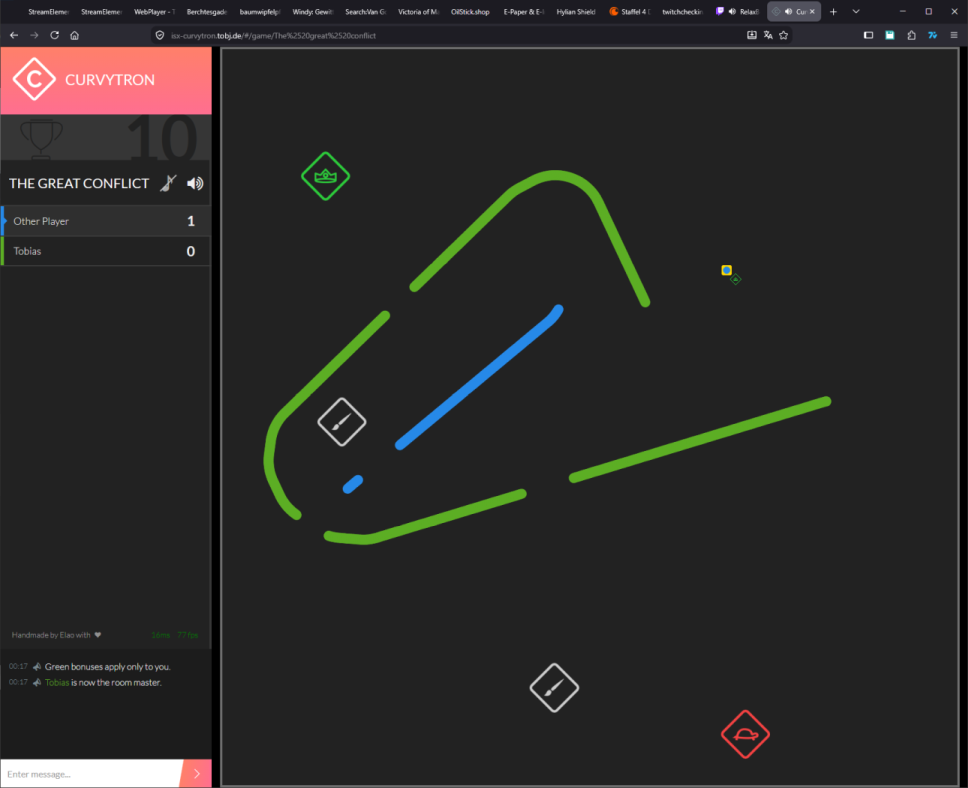

Curvytron
=========

A web multiplayer *Tron*-like game... **with curves!** Up to dozens of players share a
room, steer a constantly-moving curve with two keys (or a gamepad / touch), try not to
crash into a trail, and grab bonuses that speed up, shrink, invert or otherwise mess with
everyone. Server-authoritative, real-time, runs in any modern browser on a `<canvas>`.

This repository is a fork of the original [Elao/curvytron](https://github.com/Elao/curvytron).
The 2015-era AngularJS / Gulp / Bower stack has been **rewritten** on the `modernize`
branch to Node 24 + TypeScript/ESM on the server and Svelte 5 + Vite on the client — see
[Project status](#project-status).



---

## Table of contents

- [Gameplay](#gameplay)
- [Screenshots](#screenshots)
- [Tech stack](#tech-stack)
- [Architecture at a glance](#architecture-at-a-glance)
- [Repository layout](#repository-layout)
- [Getting started](#getting-started)
- [Configuration](#configuration)
- [Build & dev commands](#build--dev-commands)
- [Project status](#project-status)
- [Documentation](#documentation)
- [License & credits](#license--credits)

---

## Gameplay

- Create or join a **room**, pick a name and a color (one browser tab can register
  **several local players** sharing one keyboard).
- Every player controls one **avatar**: it moves forward on its own; you only press
  *left* / *right*. The avatar leaves a solid **trail** (with periodic gaps).
- Touching any trail, the arena border (unless *borderless*), or another avatar kills you.
- **Bonuses** pop on the map: self / enemy / leader / game-wide effects
  (small, fast, slow, big, inverse, master, borderless, clear, colour swap, ...).
- First to the room's **max score** wins the game; each round awards points for surviving
  and for every opponent that died before you.

## Screenshots

| | |
| --- | --- |
| [Rooms overview](doc/images/rooms-overview.png) | [Room / lobby](doc/images/lobby.png) |
| [Room config (master)](doc/images/lobby-with-config-panel.png) | [Profile panel](doc/images/my-profile.png) |
| [Round countdown](doc/images/game-start-with-countdown.png) | [In play — trails + bonuses](doc/images/game-with-trail-and-bonus.png) |
| [Round won](doc/images/game-over-round-won.png) | [Final scoreboard](doc/images/game-end-score-board.png) |

These are the pre-rewrite **visual baseline** — each screen was matched before it was
rebuilt in Svelte.

## Tech stack

| Layer | Technology | Notes |
| --- | --- | --- |
| Server runtime | **Node.js 24**, [Express 5](https://expressjs.com/) (static serving) | ESM/TS; entry `src/server/main.ts` → bundled to `dist-server/main.js` |
| Realtime transport | [`ws`](https://github.com/websockets/ws) | Raw WebSocket + a **custom batched JSON protocol**, *not* Socket.IO |
| Client framework | **Svelte 5** (runes) + **Vite 6** + TypeScript | Routing (hash), lobby, chat, profile, in-game HUD |
| Rendering | Plain `<canvas>` 2D, `requestAnimationFrame` loop | Kept outside Svelte's reactivity |
| Sound | *(pending — Web Audio, see status)* | Legacy `createjs-soundjs` dropped |
| Input | In-repo keyboard / touch mappers | Gamepad capture stubbed (was unfinished upstream) |
| Shared code | `src/shared/**` TS classes extended by both sides | `EventEmitter` = `eventemitter3` |
| Build | **esbuild** (server bundle) + **Vite** (client) | npm + `package-lock.json`, Node 24 |
| Lint / types / test | ESLint 9 (flat) · `tsc` · `svelte-check` · Vitest | |
| Container | Multi-stage `node:24-alpine` `Dockerfile` + `docker-compose.yml` | |
| Deferred | InfluxDB "Inspector" + `trackers/*` | Still legacy `.js`, config-gated off, not wired into the ESM build |

## Architecture at a glance

```
                 browser                              node.js
        ┌───────────────────────┐            ┌────────────────────────┐
        │ Svelte 5 shell + HUD  │            │ Express 5 (static dist)│
        │ stores (room / game)  │  WebSocket │ Server / ws upgrade    │
        │ Canvas 2D renderer    │◄──────────►│ Rooms → Room →          │
        │ rAF client loop       │  batched   │   GameController        │
        │ SocketClient          │  JSON      │ Game loop (setTimeout)  │
        └───────────────────────┘  events    │ World grid (Islands)    │
                                             └────────────────────────┘
```

Three source trees under `src/`, all TypeScript ESM:

- **`src/shared/`** — real `class`es (`BaseGame`, `BaseAvatar`, `BaseTrail`,
  `BaseRoomConfig`, `BaseBonus*`, `BaseSocketClient` = the wire protocol, `Collection`, …)
  extended by **both** sides so shared logic behaves identically.
- **`src/client/`** — the Svelte app: `App.svelte` + `routes/*`, `lib/stores/*`
  (`room`, `game`, `rooms`, `profile`), `lib/socket/*` (typed protocol wrapper), and the
  canvas engine (`model/Game.ts`, `model/Avatar.ts`, `manager/BonusManager.ts`, `core/Canvas.ts`,
  `animation/*`). The lobby/game state lives in stores — there is no client `Room`/`RoomConfig` model.
- **`src/server/`** — authoritative simulation: collision via a spatial grid
  (`World` → `Island` → `AvatarBody`/`Body`), fixed-timestep loop
  (`BaseGame.loop`, `framerate = 1000/60`, `setTimeout`), room/roomlist/game controllers,
  bonus manager, `ws` transport (`core/Server.ts`, `core/SocketClient.ts`).

**Wire protocol.** [`BaseSocketClient`](src/shared/core/BaseSocketClient.ts) batches
outgoing events into a JSON array `[[name, data, callbackId?], ...]` and flushes them on an
interval; numeric first elements are RPC-style callback replies. The client's typed view of
it is [`src/client/lib/socket/`](src/client/lib/socket).

See [`doc/architecture.md`](doc/architecture.md) and
[`doc/conversion-notes.md`](doc/conversion-notes.md) for detail.

## Repository layout

```
src/
  shared/        Base* classes shared by client and server (TS)
  client/        Svelte 5 + Vite app
    main.ts        mount + socket connect
    App.svelte     shell: header / footer / connection banner / route switch
    routes/        RoomsList, About, Room (lobby), Game (canvas + HUD), Profile
    lib/
      router.ts      hash routes  /  /about  /room/:name  /game/:name
      socket/        typed protocol wrapper (events.ts + client.ts)
      stores/        rooms, room, game, profile
    model/         canvas engine: Game, Avatar, Trail, BonusStack, Player, bonus/*
    manager/       BonusManager (sprite sheet)
    core/          Canvas, SocketClient, StopWatch
    animation/     BounceIn, Explode, ExplodeParticle
  server/        Node app (TS)
    main.ts        loadConfig() + Server
    core/          Server (ws upgrade), SocketClient, World, Island, Body, PingLogger
    controller/    RoomsController, RoomController, GameController
    model/         Game/Avatar/Room/Player/... + model/Bonus/* (all bonus types)
    manager/       BonusManager, KickManager, PrintManager
    trackers/      InfluxDB trackers — deferred, still .js, not wired up
scripts/build-server.mjs   esbuild server bundle
web/             Static media (images/, sounds/, font/) — copied into dist/ by Vite
dist/ dist-server/         Build output (git-ignored)
doc/             Documentation (this file links into it)
doc/reference-build/       Extracted artifacts of the frozen 2015 build (reference only)
Dockerfile / docker-compose.yml / .dockerignore
config.json.sample         Copy to config.json to configure (optional)
```

## Getting started

Requires **Node ≥ 24** and npm.

```bash
npm install
npm run build          # -> dist-server/main.js + dist/
npm start              # serves dist/ on http://localhost:8080/
```

Open <http://localhost:8080/>, pick a name, create a room, and play.

### Local development

Two shells:

```bash
npm start              # game server on :8080 (rebuild with `npm run dev` on change)
npm run dev:client     # Vite dev server; proxies /socket -> ws://localhost:8080
```

Open the Vite URL it prints. The client hot-reloads; the server you restart.

### Docker

```bash
docker compose up --build      # multi-stage node:24-alpine, serves on :8080
```

`docker-compose.yml` builds from source today; switch it to `image: …` once CI publishes
to a registry ([`doc/deployment.md`](doc/deployment.md)).

## Configuration

`config.json` is **optional** — without it the server uses port 8080 and the inspector is
off. To customise, `cp config.json.sample config.json` and edit:

| Key | Type | Default | Description |
| --- | --- | --- | --- |
| `port` | Number | `8080` | HTTP + WebSocket port (env `PORT` overrides) |
| `inspector.enabled` | Boolean | `false` | InfluxDB metrics inspector — **not yet ported**, currently a no-op |

Env vars: `PORT`, `STATIC_DIR` (defaults to `dist` if built, else `web`),
`INSPECTOR_ENABLED`. `config.json` is git-ignored.
Full reference: [`doc/configuration.md`](doc/configuration.md).

## Build & dev commands

| Command | What it does |
| --- | --- |
| `npm run build` | `build:server` + `build:client` |
| `npm run build:server` | esbuild bundle `src/server/main.ts` → `dist-server/main.js` |
| `npm run build:client` | `vite build` → `dist/` (bundle + `web/` media) |
| `npm start` | `node dist-server/main.js` |
| `npm run dev:client` | Vite dev server |
| `npm run dev` | Rebuild the server bundle on `src/**` change |
| `npm run typecheck` | `tsc --noEmit` (shared + server + scripts) |
| `npm run check` | `svelte-check` (client) |
| `npm run lint` | ESLint |
| `npm test` | Vitest (`src/{shared,server}/**/*.{test,spec}.ts`) |

Green gate before committing:
`npm run typecheck && npm run check && npm run lint && npm test && npm run build`.
Build outputs (`dist/`, `dist-server/`) are git-ignored.

## Project status

The modernization (roadmap phases 1–3 + the client rewrite) is **largely done** on the
`modernize` branch:

- ✅ Build & deps: Gulp/Bower/JSHint → **npm + esbuild + Vite + ESLint**, `package-lock.json`, Node 24.
- ✅ Language: every `src/**` file is **ESM TypeScript** with real modules (`.ts` imports,
  `@shared` alias); `Base*` are real classes extended by both sides.
- ✅ Transport: `faye-websocket` → **`ws`**, protocol framing unchanged
  ([ADR 0002](doc/adr/0002-websocket-transport.md)).
- ✅ Client: AngularJS → **Svelte 5 + Vite** ([ADR 0001](doc/adr/0001-client-framework.md)) —
  rooms list, profile/onboarding, room/lobby, and the in-game canvas + HUD, each verified
  against the live server. The legacy `controller/`, `service/`, `repository/`, `views/`
  and the `model/*.js` are gone.
- ✅ Deploy: multi-stage `node:24-alpine` `Dockerfile` (non-root, healthcheck).

Still open:

- **Sound** — `createjs-soundjs` was dropped; a Web Audio replacement for the
  death / bonus / win cues is pending.
- **CI** — GitHub Actions to run lint/typecheck/test/build and publish the image.
- **InfluxDB Inspector + `trackers/*`** — still legacy `.js`, config-gated off; port when needed.
- **Gamepad input capture** — stubbed (unfinished upstream too); keyboard + touch are live.

Progress log: [`doc/conversion-notes.md`](doc/conversion-notes.md).
Contributor-facing notes: [`CLAUDE.md`](CLAUDE.md).

## Documentation

| Doc | Contents |
| --- | --- |
| [`doc/architecture.md`](doc/architecture.md) | Connection → room → round lifecycle, server core objects, client wiring |
| [`doc/game-rules.md`](doc/game-rules.md) | Movement/turn physics, trail & printing, collision & death, scoring, rounds, map sizing, the bonus catalogue, all constants |
| [`doc/protocol.md`](doc/protocol.md) | The WebSocket protocol: framing, batching, compression, handshake, full event reference |
| [`doc/flows.md`](doc/flows.md) | Sequence diagrams: connect, create/join room, lobby config & launch, round lifecycle, spectate, leave/close |
| [`doc/conversion-notes.md`](doc/conversion-notes.md) | The AngularJS→Svelte / JS→TS rewrite log, per-phase progress + mechanical rules |
| [`doc/assets.md`](doc/assets.md) | Static-asset inventory: bonus sprite sheet, sounds, icon font, images |
| [`doc/deployment.md`](doc/deployment.md) | Docker image (multi-stage) + `docker compose` deploy + CI image build |
| [`doc/adr/`](doc/adr) | Architecture Decision Records (0001 framework, 0002 transport) |
| [`doc/modernization-roadmap.md`](doc/modernization-roadmap.md) | The original phased plan (background) |
| [`doc/rewrite-plan.md`](doc/rewrite-plan.md) | The original client rewrite playbook (background) |
| [`doc/legacy-build-notes.md`](doc/legacy-build-notes.md) | How the frozen 2015 build + deploy worked (historical) |
| [`doc/dependency-map.md`](doc/dependency-map.md) | Every legacy dependency → npm / vendor / dropped |
| [`doc/configuration.md`](doc/configuration.md) | `config.json` reference |
| [`doc/nginx-proxy.md`](doc/nginx-proxy.md) | Reverse-proxy setup (forward `Upgrade`/`Connection`) |
| [`CLAUDE.md`](CLAUDE.md) | Working notes for automated/AI-assisted contributors |

## License & credits

MIT — see [`LICENSE`](LICENSE). Originally handmade at [Elao](http://www.elao.com) by
Thomas Jarrand and Johan Dufour; inspired by *Curve Fever*. Full credits in
[`humans.txt`](humans.txt).
