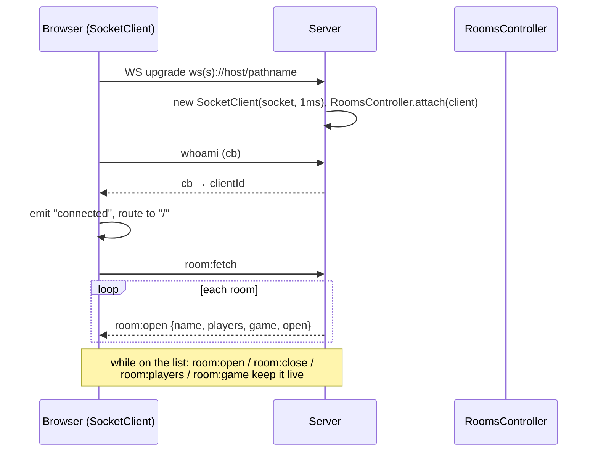
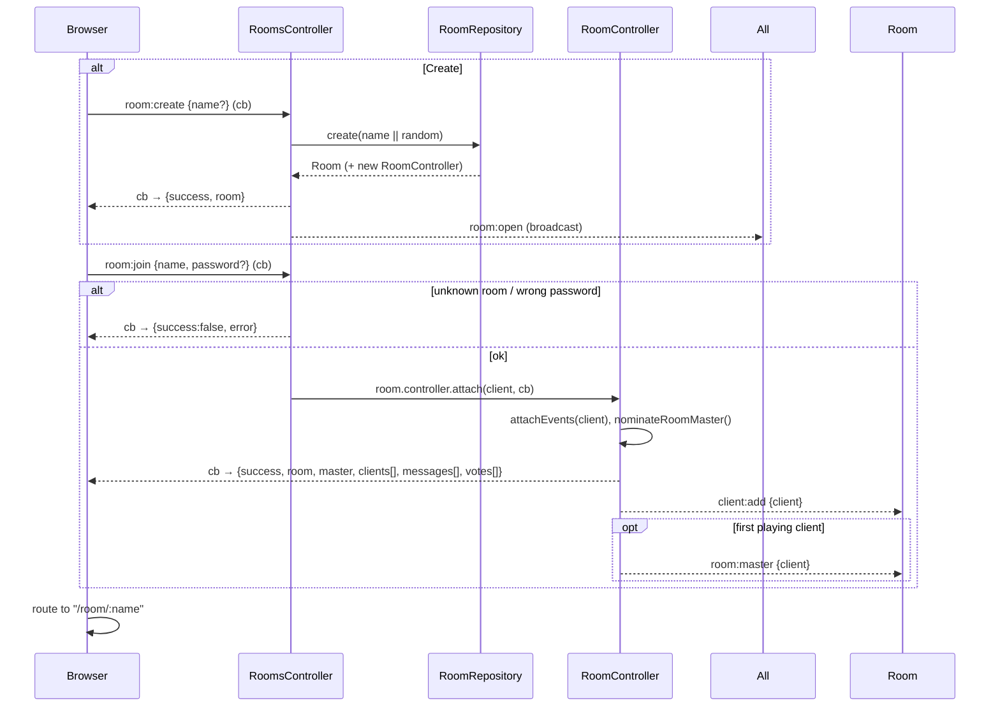
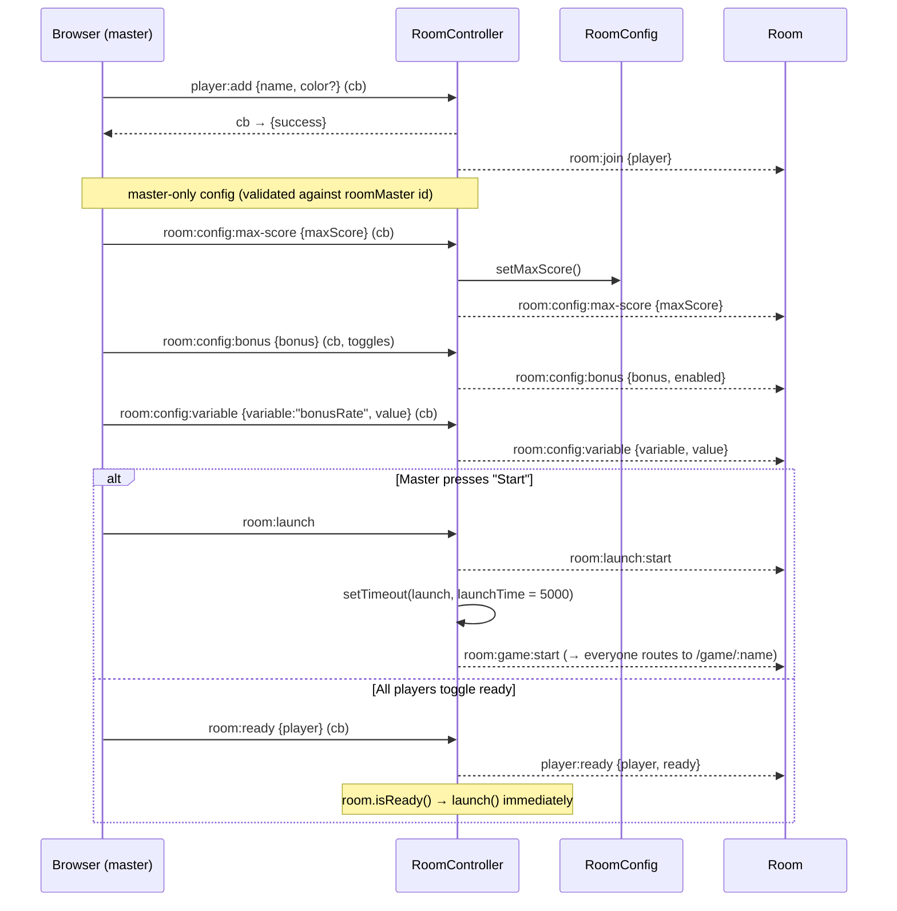

# Flows

End-to-end sequences. Event names/payloads are in [`protocol.md`](protocol.md); rules and
constants in [`game-rules.md`](game-rules.md). Diagrams render on GitHub (Mermaid).

## 1. Connect and browse rooms



## 2. Create or join a room



The `room:join` callback carries the **entire** room snapshot; the client hydrates its
`RoomRepository` from it and then keeps it in sync from broadcasts.

## 3. In the room: players, config, launch



`launch()` calls `room.newGame()` → `new Game(room)` → `game:new` → `RoomController.onGame`
broadcasts `room:game:start`.

## 4. Game round lifecycle

```mermaid
sequenceDiagram
    participant B as Browser(s)
    participant GC as GameController
    participant G as Game (shared BaseGame + server Game)

    Note over GC: game created → GC.attach() for every room client<br/>+ 30 s "waiting" timer for slow loaders
    B->>GC: ready
    GC->>G: avatar.ready = true; GC.checkReady()
    Note over G: all ready (or 30 s elapsed) → game.newRound()

    G->>G: onRoundNew: place avatars, clear world/bonuses
    GC-->>B: round:new
    Note over G: setTimeout(start, warmupTime = 3000)
    G->>G: onStart: world.activate(); bonusManager.start();<br/>printing starts after +3000 ms
    GC-->>B: game:start

    loop every ~16 ms tick (setTimeout, framerate = 1000/60)
        G->>G: update(step): move, test border, test collision,<br/>PrintManager.test, BonusManager.testCatch
        GC-->>B: position[] / angle[] / point / property (batched 1 ms)
        opt bonus timer fires
            GC-->>B: bonus:pop [id, x, y, Class]
        end
        opt avatar dies
            G->>G: kill(avatar, killer, score); addScore
            GC-->>B: die [avatar, killer, old] ; score:round
        end
    end

    Note over G: ≤ 1 avatar alive → checkRoundEnd() → endRound()
    G->>G: onRoundEnd: resolveScores (winner +N, fold roundScore→score)
    GC-->>B: round:end <winnerId|null> ; score[]
    Note over G: setTimeout(stop, warmdownTime = 5000)
    G->>G: onStop → isWon()?
    alt game won
        GC-->>B: end
        Note over GC,B: back to /room/:name; players reset
    else another round
        G->>G: newRound()  (loop back)
    end
```

Key point: **the server owns the clock and all state**. Clients render from the streamed
`position`/`angle`/`property` events and run the same shared physics only for smoothing
between updates.

## 5. Spectator joins mid-game

```mermaid
sequenceDiagram
    participant B as New browser
    participant RC as RoomController
    participant GC as GameController

    B->>RC: room:join {name}  (cb → room snapshot, game:true)
    RC->>GC: game.controller.attach(client)
    RC-->>B: room:game:start
    B->>B: route to /game/:name
    B->>GC: ready
    Note over GC: game.started → treat as spectator
    GC-->>B: spectate {inRound, rendered, maxScore}
    GC-->>B: position[] + property[] + die[] for every avatar
    opt in round
        GC-->>B: bonus:pop[] for every live bonus
    else between rounds
        GC-->>B: round:end <winnerId|null>
    end
    GC-->>Room: game:spectators <count>
```

## 6. Leave / disconnect / room close

```mermaid
sequenceDiagram
    participant B as Browser
    participant RC as RoomController
    participant R as Room
    participant Repo as RoomRepository

    alt explicit
        B->>RC: room:leave
    else socket close
        Note over RC: client "close" → same handler
    end
    RC->>RC: detach(client): remove players, GC.detach(client)
    RC-->>Room: client:remove <id> ; room:leave {player} (per player)
    opt client was master
        RC->>RC: removeRoomMaster() → nominateRoomMaster()
        RC-->>Room: room:master {client}  (if a new one exists)
    end
    opt room now empty
        RC->>RC: setTimeout(checkForClose, timeToClose = 10000)
        Note over RC: still empty → room.close()
        R-->>Repo: "close" → RoomRepository.remove(room)
        Repo-->>All: room:close {name}
    end
```

Mid-game, a leaving player's avatar is removed (`game.removeAvatar`) and `game:leave` is
broadcast; the round-end check runs so the game can resolve if only one avatar remains.
